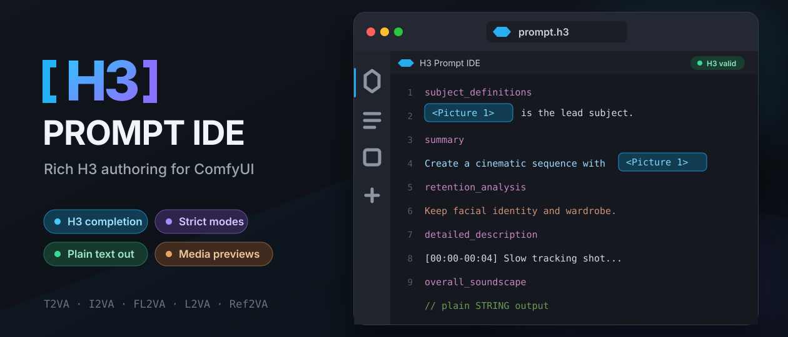

<p align="center">
  
</p>

# H3 Prompt IDE for ComfyUI

A VS Code-inspired prompt editor for MiniMax H3. It provides rich editing, strict H3 sections, completions, reference previews, and a normal ComfyUI `STRING` output.

## Install

```bash
cd ComfyUI/custom_nodes
git clone https://github.com/ethanfel/ComfyUI-H3-Prompt-IDE.git
```

Restart ComfyUI, then find the nodes under **text → H3 Prompt IDE**.

## Use

1. Add **H3 Reference Inputs** and **H3 Prompt IDE**.
2. Connect images, video frame batches, or audio to the matching H3-labelled sockets.
3. Connect `references` to the Prompt IDE.
4. Connect the IDE's `text` output to your H3 prompt input.

`H3 Reference Inputs` handles labels and previews only. For Ref2VA generation, connect the same media loaders to the matching inputs on the native H3 conditioner. Video sockets use ComfyUI `IMAGE` frame batches, matching the native H3 `ref_videos` inputs.

## Nodes

- **H3 Prompt IDE** — rich editor with a Plain/Rich source toggle, T2VA, I2VA, FL2VA, L2VA, and Ref2VA validation; H3-aware completion; section insertion; diagnostics; and plain-text output.
- **H3 Reference Inputs** — independently autogrows `<Picture 1>`–`<Picture 9>`, `<Video 1>`–`<Video 3>`, and `<Audio 1>`–`<Audio 6>` while keeping media sockets off the editor node.

Reference associations use H3's native `<Picture 1>`, `<Video 1>`, and `<Audio 1>` naming. Audio labels must follow native presentation order: connected video soundtracks first, then standalone audio. This standalone editor intentionally does not include Motion Context `@tag` or `@@@@tag` compilation.

Requires a current ComfyUI version with the V3 node API and `Autogrow` support.

The editor includes a scoped workaround for the recurring [LiteGraph widget-width bug](https://github.com/Comfy-Org/ComfyUI_frontend/issues/12443), so it resizes correctly without a separate repair node.

## Credits

H3 Prompt IDE is a standalone adaptation of the Rich Scene Prompt Editor
originally developed for
[ComfyUI-MiniMaxH3-Contex-Loop](https://github.com/ethanfel/ComfyUI-MiniMaxH3-Contex-Loop/tree/feature/0.5-workflow-ux).
The Motion Context-specific plan, history, optimizer, `@tag`, and `@@@@tag`
integration was removed here to provide a normal text-output node.

The rich reference presentation, media miniatures, quick-reference interaction,
and compact authoring layout were inspired by
[ComfyUI-MiniMaxH3-Easy](https://github.com/nkxx188/ComfyUI-MiniMaxH3-Easy)
by **nkxx188**. The standalone H3 schema, graph-aware native reference labels,
diagnostics, and plain `STRING` interface are implemented in this project.

The scoped widget-width compatibility repair is adapted with permission from
[ComfyUI-LegacyWidgetWidthFix](https://github.com/pekkAi-dev/ComfyUI-LegacyWidgetWidthFix)
by **pekkAi-dev**.

## License

[GNU GPL v3](LICENSE)
